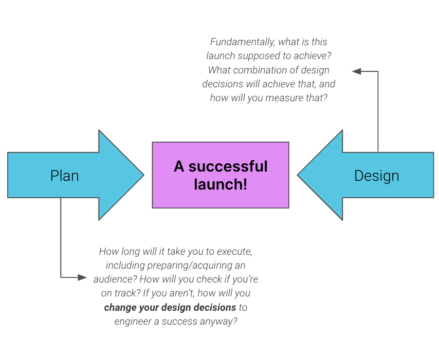

import ListAdmonition from '@site/src/components/ListAdmonition';

<ListAdmonition>
    <ul>
        <li>A sample framework for designing your launch</li>
     </ul>
</ListAdmonition>

## Prerequisites

- [Designing an NFT drop](designing-an-nft-drop)
- [Understanding launch mechanics](understanding-launch-mechanics)

# Launch targets

Previously, we introduced the concept of Launch Goals. Recall, a Launch Goal is a clearly articulated reason that you are launching and how this launch solves your project goals. Your Launch Goal is useful to guide your launch design as you consider tradeoffs across launch mechanics.

A related but distinct concept is the **Launch Target**, which is just as important as Launch Goals when you are planning your launch. A Launch Target is a measure of success that you can use to assess the performance of your launch and course-correct for future launches. We suggest setting at least one SMART ( **S** pecific, **M** easurable, **A** ttainable, **R** elevant, **T** ime-bound) target for your launch. A lot has been written about setting SMART targets (such as [here](https://www.mindtools.com/pages/article/smart-goals.htm) and [here](https://www.atlassian.com/blog/productivity/how-to-write-smart-goals)) so this article will not go into detail on how to do it, but we highly recommend reading up on the process and setting your own targets.

Some examples of SMART targets for an NFT launch are:

- **Engineer a sellout** - 100% of available NFTs are purchased in <1 day
- **Attract unique buyers** - number of unique holders immediately after launch is \>25% of available NFTs
- **Leave the community excited** - community perception of drop one week after launch is \>75% measured by a community pulse survey.
- **Build traders** - secondary trading volume in the two weeks after launch is \>10% of launch volume
- **Build buying habit** - secondary trading prices in the two weeks after launch are \> primary sale price

# Launch Planning

To be successful, a launch should be thought of as an integrated campaign, and marketing, community and technical aspects must be considered.

Below are some practical recommendations to consider when planning for your launch. Marketing/community and technical execution are extremely important, which is why we've chosen these to highlight. However, they are just a starting point and should not be considered an exhaustive list. You should think through your launch from all angles and plan accordingly.

## Marketing and Community

- We suggest developing a pre-launch growth campaign to maximise attention and success
- In general, a minimum of 4 weeks of launch campaigning should be planned for before the launch
- Ensure initiatives are targeting the target user segment with an appropriate sub-narrative for the launch
- Consider avoiding providing firm details such as date, price and number of NFTs until either 4 weeks before planned launch, or until the community size is sufficient to support the planned launch. This gives you a valuable opportunity to 'temperature check' the community and adjust your launch mechanics, if required

## Technical Execution

- Involve technical teams in the launch mechanic definition process to identify likely timelines and any constraints. This helps to avoid surprises close to launch
- Before announcing firm dates, check the technical readiness for the launch. Web3 users are largely intolerant of missed commitments, and there should be high confidence that the launch will be technically ready with no blockers before committing a date
- We recommend allowing at least 2 weeks for testing between technical work being complete and a publicly shared launch date
- Agree on a support / on-call plan for technical and community teams over launch to address any emerging issues

# Putting it all together

In this series, we've provided a lot of detailed information on concepts that you can use to inform your launch planning and design. It's a lot, so to summarize, we've put together a handy-dandy framework that you can use to guide you!

Here are the 8 steps you should follow:

" **The design" - work backwards to design your launch mechanics:**

1. What are the project goals?
2. What are the goals for this launch, that will achieve the project's goals?
3. What mechanics will help you achieve those goals? Have you checked against market trends?
4. How will you measure success, including driving secondary trading?

" **The plan" - work forwards to your launch date:**

1. Define technical plan including testing
2. Define marketing and community strategy
3. Build in a 'temperature check' for community and technical readiness
4. Allow at least 4 weeks between temperature checks and announcement of all details

# Final thoughts

Your NFT drop (or drops) is one of the most important project milestones, second possibly only to the release of your game. A successful launch signals to the market that your project has what it takes to become a winner, and builds momentum for the overall performance of your project. Accordingly, you can't leave your launch up to chance. Fortunately, you **can** engineer success! We hope that this article has equipped you with the foundations to be successful, now it's up to you!