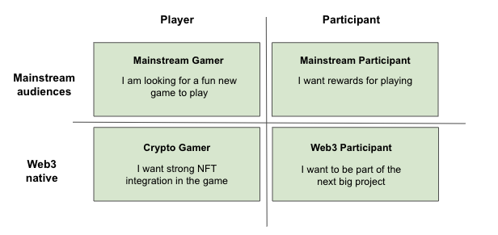

In this article you will learn

- An introduction to customer segmentation
- Why you should segment
- A sample framework on segmentation

## Introduction

Customer segmentation involves splitting your users into groups with similar characteristics and interests. This should be one of the first activities you conduct, as the segments you define have a direct impact on how you market and communicate to each segment.

## Key benefits

The purpose of segmentation is to help structure and test your strategy and tactics as you develop and execute them. This allows you to better empathize deeply with the customer and their needs.

## How to segment
Your customer segments and the relative attention you give to each segment today vs tomorrow, will differ depending on your lifecycle stage, your game mission, the type of game you're building, your target demographic, and a range of other factors.

Here's an example of a generic split:

There are many combinations of segments and you can go as deep as you'd like. Some projects may choose to segment further based on their needs and these subgroups will have significantly different behaviors. For example, players could also be broken down into lifecycle stages like 1-30 days or 30+ days and you may choose to use different strategies to target each group.

If you're unsure where to start, having a high level split like Web3 audiences vs mainstream audiences can help you draw a clear line. You can also use segmentation by other parties for inspiration, for example [Naviik's 9 types of Blockchain Gamers](https://naavik.co/digest/blockchain-players) and slowly tailor these to your project.

## Template

This template can be used as a preliminary exercise to segment your customers and determine tactics for each segment.

1. We have filled in the first row as an example
2. Fill in the other questions for each of your segments
3. The tactics you focus on will be the ones that best serve your target segments

| **Segment** | **Person** | **Motivation** | **Priorities** | **Tactics** |
| --- | --- | --- | --- | --- |
| **Mainstream Player** | Mainstream Gamer | I am looking for a fun new game to play | <ul><li>Believe that the game will be fun to play with a strong concept and narrative</li><li>Feel comfortable making the transition to web3</li></ul> | <ul><li>Develop a playable demo with positive reviews</li><li>Target prominent Web2 twitch streamers</li><li>Reddit AMA </li></ul>
  | **Degen Player** | | | | | 
   **Mainstream Participant** | | | | 
    **Degen Participant** | | | | 

 